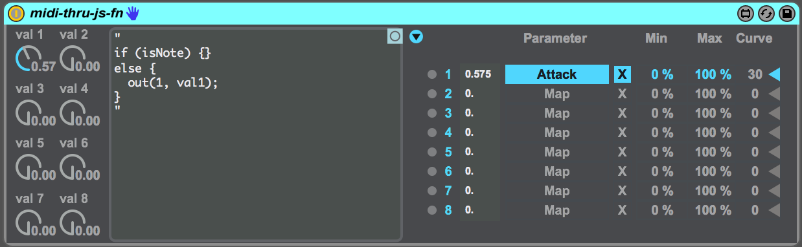

midi thru js fn
====================

about
-------------
a Max for Live device for writing javascript in Ableton

documentation
--------------

#### out(port, value)
output a value to a mapper

#### setTimeout(fn, ms)
wait for the specified time in milliseconds, then run the given function

#### wait(ms, fn)
An alias for setTimeout

#### rand(low = 0, hi = 1, asInt = false)
returns a random value between low and high. Defaults to a random value between 0 and 1

#### scale(value, s1, s2, e1, e2)
linearly scale a value from range s1 to s2, to range e1 to e2

#### valscale = function (value, e1, e2)
linearly scale a value between 0 and 1 to range e1 to e2

#### valtomidi(value)
convert a value between 0 and 1 to an int between 0 and 127

#### miditoval(value)
convert an int between 0 and 127 to a float between 0 and 1

#### ftom(freq)
convert a freqency in hertz to the corresponding midi note number

#### mtof(midiNoteNumber)
convert a midi note number to a frequency in hertz

#### clamp(val, min, max)
confine a value to range min to max

#### snap(note, scale)
force a midi value to the nearest midi value in a scale. Scales are defined as an array of ints between 0 and 11 representing the twelve chromatic notes of western music theory.

### Array extensions
#### [].foreach(fn)
run a function on each item in an array modifying it in place.

#### [].map(fn)
map each item in an array to a new value and return the new array.

#### [].range(len)
returns an array of ints from 0 to len - 1

#### [].zeros(len)
returns an array of zeros of length len
